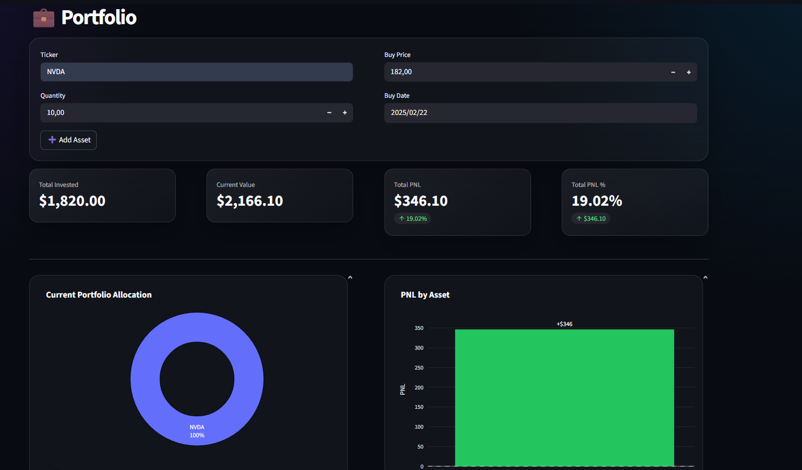
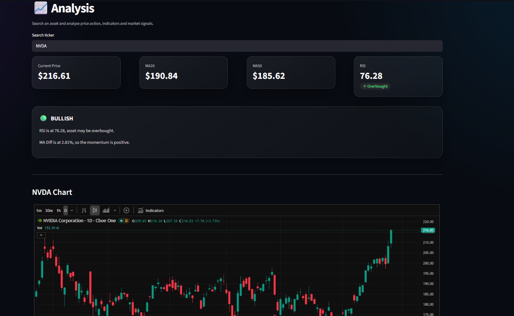

## Portfolio Market Dashboard

🌐 Live Demo: https://financial-portfolio-dashboard.streamlit.app  
🔗 LinkedIn: https://linkedin.com/in/antonio-namniyek

A modern financial dashboard built with Streamlit to track portfolio performance, analyze assets, and compare results against the S&P 500 using real-time market data.

---

##Preview

### Portfolio Insights


### Analysis


---

## Features

### Portfolio Management
- Add assets manually
- Automatically update existing positions using average buy price
- Remove selected assets from the portfolio
- Track quantity, buy price, buy date and current price

### Market Data
- Real-time prices via yfinance
- Cached data for better performance
- Manual refresh support

### Performance Tracking
- Total invested
- Current portfolio value
- Total PNL
- PNL percentage
- Daily PNL
- Portfolio value over time

### Visualizations
- Portfolio allocation donut chart
- PNL by asset bar chart
- Portfolio performance chart
- Optional comparison with the S&P 500 benchmark

### Analysis Page
- Search any asset ticker
- TradingView chart integration
- Current price
- MA20 and MA50
- RSI
- MA difference percentage
- Bullish / Bearish / Neutral signal box

### Market Signals
- RSI-based overbought / oversold detection
- MA20 vs MA50 trend classification
- Momentum interpretation using MA Diff
- Clean signal summary for faster decision-making

---

## Project Structure

```text
src/
├── charts.py          # Plotly visualizations
├── indicators.py      # RSI, MA20, MA50 and market signals
├── portfolio.py       # Portfolio calculations and benchmark logic
├── market_data.py     # Price fetching
├── formatting.py      # Table formatting
├── tradingview.py     # TradingView chart integration
├── ui.py              # UI layout helpers and custom styling loader
├── styles.css         # Custom dashboard styling

pages/
├── 📊_Portfolio.py
├── 🔍_Analysis.py

🏠_Home.py

```
## Technologies

- Python  
- Streamlit  
- pandas  
- yfinance  
- Plotly  
- TradingView widget  
- HTML / CSS  

---

## How to Run

```bash
pip install -r requirements.txt
streamlit run "🏠_Home.py"
