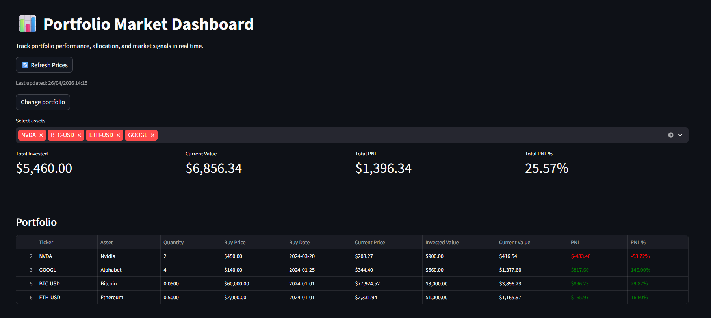
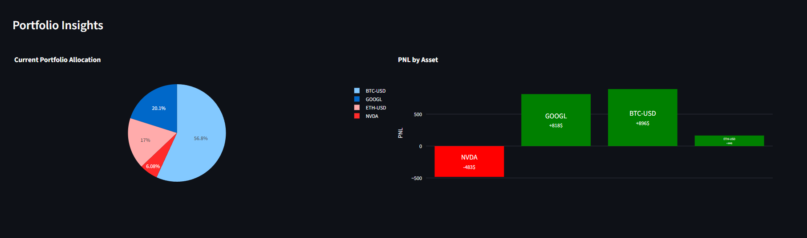
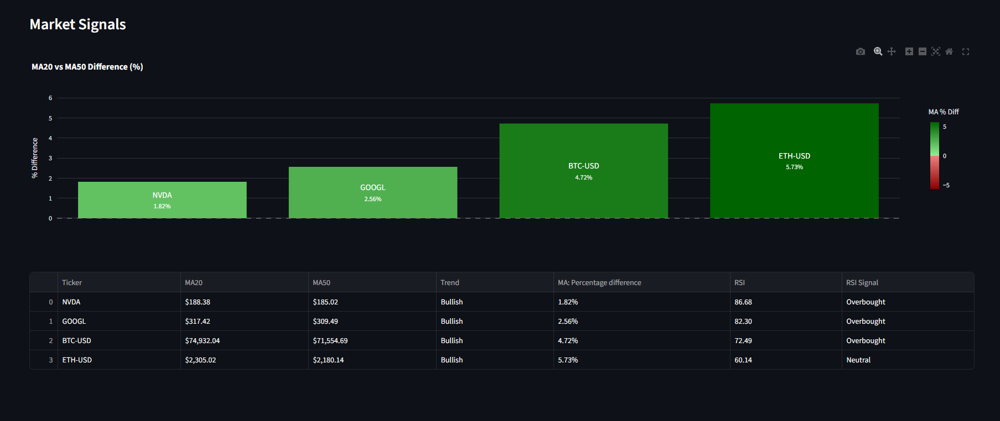

## 📊 Portfolio Market Dashboard

🌐 Live Demo: https://financial-portfolio-dashboard.streamlit.app  
🔗 LinkedIn: https://linkedin.com/in/antonio-namniyek

An interactive financial dashboard built with Streamlit to track and analyze a portfolio using real-time market data.

---

## 📷 Preview

### Dashboard Overview


### Portfolio Insights


### Market Signals



## 🚀 Features

### 📁 Portfolio Management
- Load your own portfolio via CSV upload
- Built-in example portfolio
- Automatic persistence of selected portfolio
- Asset filtering (multi-select)

### 📈 Market Data
- Real-time prices via yfinance
- Cached data for performance
- Manual refresh option

### 💰 Performance Tracking
- Total invested vs current value
- Profit & Loss (PNL)
- PNL percentage

### 📊 Visualizations
- Portfolio allocation (pie chart)
- PNL by asset (bar chart)
- Moving average comparison (MA20 vs MA50)
- Trend strength visualization (normalized % difference)

### 📉 Market Signals
- MA20 & MA50 indicators
- Trend classification (Bullish / Bearish)
- RSI (Relative Strength Index)
- RSI signals (Overbought / Oversold / Neutral)
- Gradient-based visualization for trend strength

---

## 🧱 Project Structure

src/
│
├── charts.py # Plotly visualizations
├── indicators.py # RSI, MA signals
├── portfolio.py # Portfolio calculations
├── market_data.py # Price fetching
├── formatting.py # Table formatting
├── data_loader.py # Upload / persistence logic
├── ui.py # UI layout helpers


---

## 🛠 Technologies

- Python
- Streamlit
- pandas
- yfinance
- Plotly

---

## ▶️ How to Run

```bash
pip install -r requirements.txt
streamlit run app.py